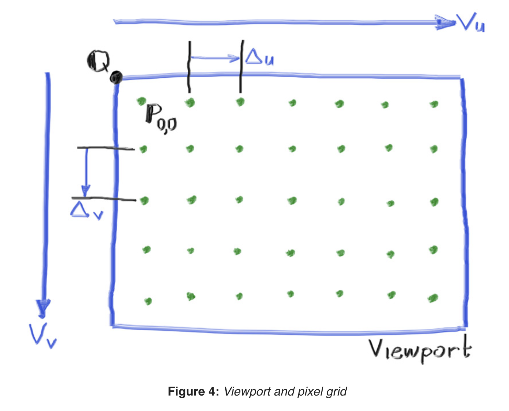
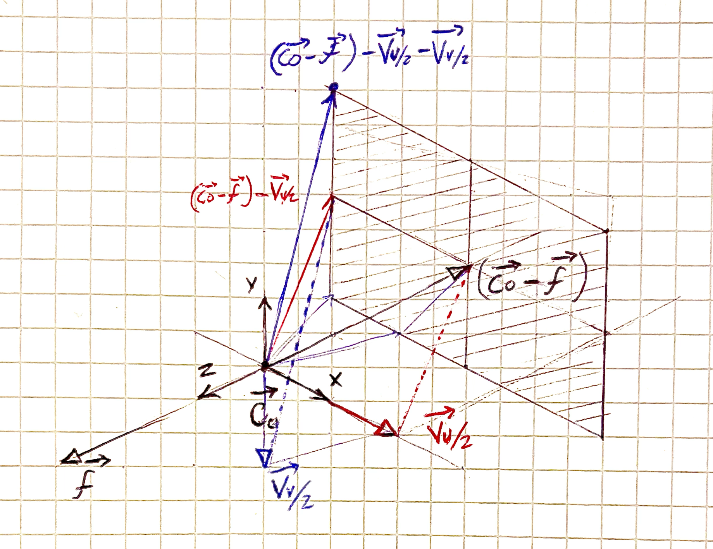

# Equations

## Aspect Ratio
$$
\begin{align*}
\frac{16}{9} &= \frac{800}{h} \\
h &= \frac{800}{\left( \frac{16}{9} \right)} \\
h &= 800 \times \frac{9}{16} \\
h &= 450
\end{align*}
$$

## The view port and the pixel grid

“Figure 4: Viewport and pixel grid” ([“Ray Tracing in One Weekend”](zotero://select/library/items/U4P99R5P)) ([snapshot](zotero://open-pdf/library/items/63GD2R2R?sel=center%3Anth-child(163)%20%3E%20div%20%3E%20center%20%3E%20span))

## Finding the viewport upper left corner point Q

My approach using descriptive geometry

## The graphics good-old trick
$$
\text{blendedValue} = (1 - \alpha) \cdot \text{startValue} + \alpha \cdot \text{endValue}
$$

## Ray-Sphere intersection

$$
(C - O + D \cdot t) \cdot (C - O + D \cdot t) = r^2
$$

Expanding this:

$$
(D \cdot D) \cdot t^2 - t \cdot [2 \cdot D \cdot (C - O)] + [(C - O) \cdot (C - O) - r^2] = 0
$$

Where the discriminant is:

$$
\text{discriminant} = b^2 - 4 \cdot a \cdot c
$$

Conditions:
- Discriminant = 0 → one intersection
- Discriminant > 0 → two intersections
- Discriminant < 0 → no intersections
